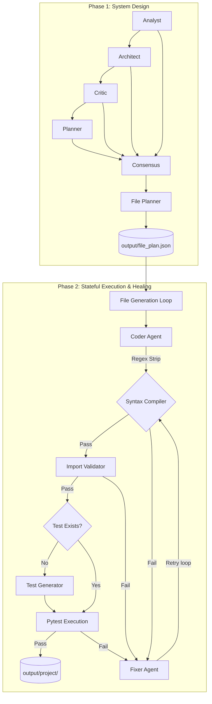
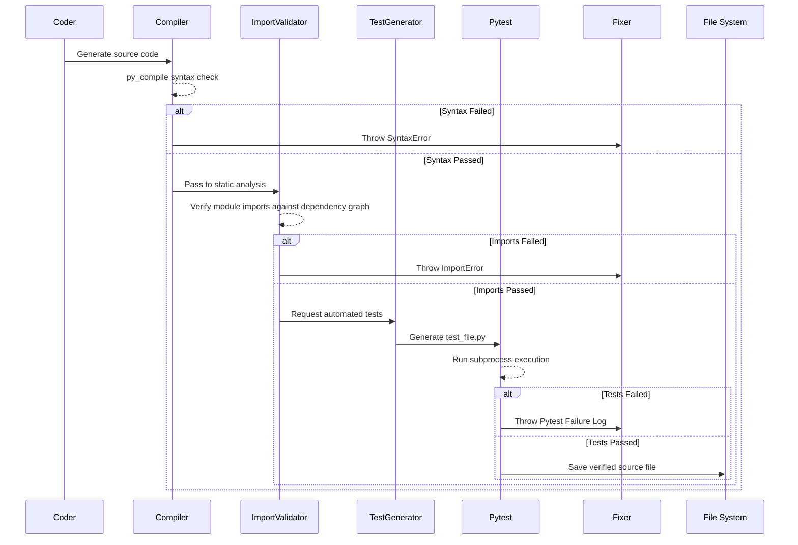

# Agentic Codex (v0.5.0)

## ⭐ Highlights

- **Fully local multi-agent software engineering system**
- **Generates complete project structures from natural language requirements**
- **Self-healing pipeline with automated code repair**
- **Compilation, import, and test validation loops**
- **Local execution using Ollama and Qwen models**
- **Context-aware file generation using dependency graphs**
- **Agent output caching for rapid iteration**

Agentic Codex is an advanced, fully autonomous AI software engineering pipeline. Instead of a single LLM trying to write an entire project at once, Agentic Codex breaks down the software development lifecycle into specialized, distinct agents. The system is entirely self-healing—capable of catching its own syntax errors, broken imports, and failed unit tests, and intelligently repairing its own code.

## 🛠️ Example

**Input:**
> "Build a FastAPI Todo API with JWT authentication."

**Generated Output:**
```
output/project/
├── requirements.txt
├── app/main.py
├── app/auth/
│   └── routers/login.py
├── app/todos/
│   └── routers/v1/todos.py
└── tests/
    ├── test_login.py
    └── test_todos.py
```

## 🚀 Technical Innovations

- **Context-aware code generation** using dependency metadata to prevent context bloat.
- **Self-healing repair loop** driven by raw compiler and test feedback.
- **Agent output caching** using MD5 prompt hashing for lightning-fast iteration.
- **Dynamic file planning** generated from synchronized agent consensus specifications.
- **Automated test generation and validation** executed in a sandboxed environment.
- **Import graph verification** before runtime execution to halt hallucinations early.

---

## 🏗️ High-Level Architecture

The system operates in two major phases: **System Design** and **Iterative Generation & Testing**.



### Phase 1: System Design

The design phase utilizes a linear chain of dependent LLM agents. To ensure lightning-fast execution during iterative development, **all LLM calls in Phase 1 are MD5-hashed and cached** to the filesystem (`output/cache/`).

1. **Analyst Agent**: Extracts concrete functional and non-functional requirements.
2. **Architect Agent**: Proposes a high-level system architecture, technology stack, and database schema.
3. **Critic Agent**: Reviews the architecture to identify security flaws, scalability issues, and edge cases.
4. **Planner Agent**: Synthesizes the architecture and critique into an implementation roadmap.
5. **Consensus Agent**: Combines the outputs into a final, unified `Consensus Specification`.
6. **File Planner Agent**: Translates the consensus into a structured JSON array defining file paths, descriptions, and structural dependencies (`depends_on`).

### Phase 2: Stateful Generation, Testing & Healing

For every file defined by the File Planner, the system isolates its context using its `depends_on` array and enters the execution pipeline:



#### 🔄 The Stateful Fixer Loop

If *any* of the stages fail, the pipeline drops into a 3-retry self-healing loop powered by the **Fixer Agent**.
The Fixer Agent is fully state-aware. It receives the Error Type, the Error Log, the Current Code, and a **Repair History** of its previous failed attempts to prevent hallucination oscillation.

---

## 🧠 The Brain (The LLM Engine)

Agentic Codex is powered entirely locally via Ollama (e.g., `qwen2.5-coder:7b`). By utilizing specialized code-generation models locally, the pipeline guarantees total data privacy while maintaining exceptional performance. **Agents leverage specialized prompting and model configurations optimized for their individual responsibilities** (`num_predict`, system prompts, etc.).

## ⚙️ Design Philosophy

Agentic Codex intentionally avoids heavyweight orchestration frameworks like LangChain or AutoGen. Instead, it uses a **custom, transparent Python orchestration loop**.

**Reasons:**
- Full visibility into agent interactions
- Easier debugging
- Lower runtime overhead
- Complete control over state management
- Framework-independent architecture

## 🔒 The Execution Sandbox

To prevent rogue or hallucinated code from damaging the host operating system:
- **Isolated Subprocesses**: All testing is executed via the `subprocess` module with strict timeouts.
- **Constrained Working Directories**: The execution path is hard-locked to the `output/project/` directory.
- **Static Safeguards**: Before any code is ever executed, it must statically pass compiler validation and the `ImportValidatorAgent`.

## ⚡ Performance

**Hardware Context:**
- AMD Ryzen 5 5500U | 16 GB RAM | WSL2 Ubuntu

**Models:**
- `qwen2.5:3b`
- `qwen2.5-coder:7b`

**Typical Pipeline Execution:**
- Requirement Analysis: ~45 sec
- Architecture Design: ~50 sec
- Project Planning: ~170 sec
- File Generation: 1–5 min/file
- Self-Healing Retries: up to 3 attempts

## 🎬 Sample Run

To see exactly what it looks like when the pipeline designs, codes, tests, and self-heals a complete backend, check out this unedited raw log from our v0.4.5 run:

👉 [**ToDo FastAPI Generation Log**](example/todo_fastapi.log)

This log shows the pipeline extracting the architecture, running test loops, using its stateful repair history to fix broken code, and finally outputting the entire working project entirely autonomously.

## 🔮 Roadmap

### v0.6
- Dependency graph scheduling
- Parallel file generation
- Persistent repair memory

### v0.7
- Runtime integration testing
- API endpoint validation
- Dependency resolution agent

### v1.0
- Autonomous software engineering agent
- Multi-language support
- Long-term project memory

---

## 🚀 Running the Pipeline

Ensure you have your environment set up and `pytest` installed, then run the entry point:

```bash
python main.py
```
