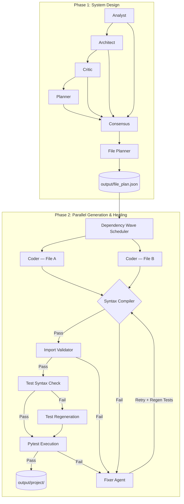
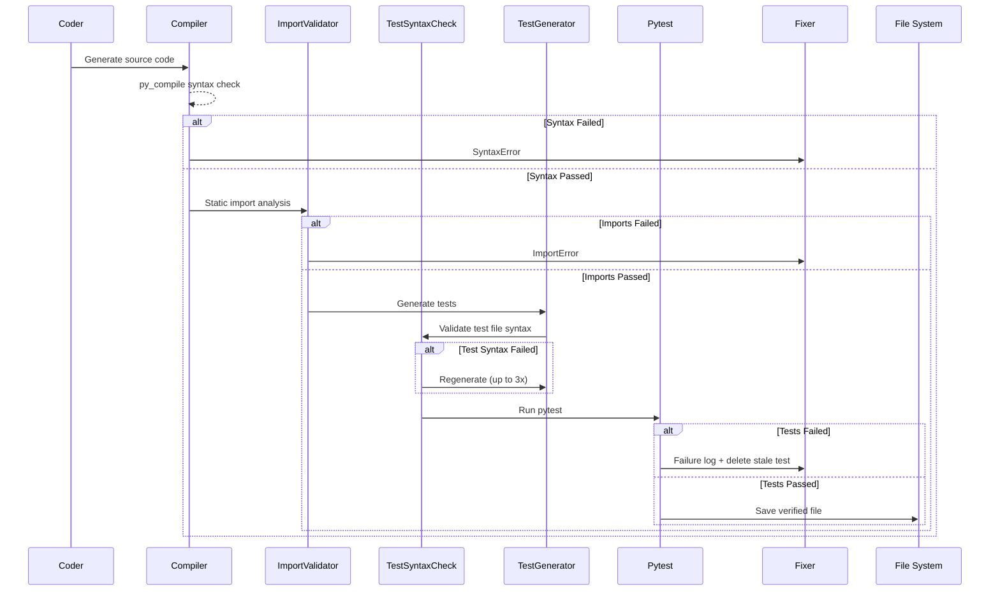

# Agentic Codex (v0.7.0)

## ⭐ Highlights

- **Fully local multi-agent software engineering system**
- **Generates complete project structures from natural language requirements**
- **Self-healing pipeline with automated code repair**
- **Compilation, import, and test validation loops**
- **Local execution using Ollama — choose any model at runtime**
- **Context-aware file generation using dependency graphs**
- **Parallel file generation** with wave-based dependency scheduling
- **Persistent repair memory** across runs
- **Agent output caching** for rapid iteration, with `--no-cache` / `--clear-cache` flags
- **Docker + AWS deployable** out of the box
- **Runtime integration testing** — runs generated projects and validates they start cleanly
- **API endpoint validation** — auto-discovers and hits FastAPI/Flask routes, asserts HTTP 2xx
- **Dependency resolution** — installs `requirements.txt` into an isolated venv before tests

Agentic Codex is an advanced, fully autonomous AI software engineering pipeline. Instead of a single LLM trying to write an entire project at once, Agentic Codex breaks down the software development lifecycle into specialized, distinct agents. The system is entirely self-healing—capable of catching its own syntax errors, broken imports, and failed unit tests, and intelligently repairing its own code.

---

## 🛠️ Example

**Input:**
```bash
python main.py "Build a FastAPI Todo API with JWT authentication."
```

**Generated Output:**
```
output/project/
├── requirements.txt
├── app/main.py
├── app/auth/
│   └── routers/login.py
├── app/todos/
│   └── routers/v1/todos.py
└── tests/
    ├── test_login.py
    └── test_todos.py
```

---

## 🚀 Quick Start

### Install dependencies

```bash
pip install -r requirements.txt
```

### Run with default models

```bash
python main.py "Build a FastAPI Todo API with JWT auth"
```

### Choose your models

```bash
python main.py "Build a FastAPI Todo API" \
  --planner-model qwen2.5:7b \
  --coder-model   qwen2.5-coder:14b
```

### List available models

```bash
python main.py --list-models
```

### Other options

```bash
# Skip cache — force fresh LLM calls
python main.py "..." --no-cache

# Wipe all cached outputs then run
python main.py "..." --clear-cache

# Control parallelism
python main.py "..." --workers 4

# Write output to a custom directory
python main.py "..." --output-dir /path/to/my/output

# Adjust log verbosity
python main.py "..." --log-level DEBUG
```

---

## 🐳 Docker / AWS Deployment

A full Docker Compose setup ships with the project. It runs Ollama and AgentForge as two containers, wired together automatically.

### Run locally with Docker Compose

```bash
# Set your task (default: "Build a simple FastAPI Hello World API.")
export AGENTFORGE_TASK="Build a REST API."
export AGENTFORGE_PLANNER_MODEL="qwen2.5:3b"
export AGENTFORGE_CODER_MODEL="qwen2.5-coder:7b"

docker compose up --build
```

Generated files appear in `./output/project/` on the host (volume-mounted).

### Deploy to AWS EC2

See `infra/user-data.sh` for the EC2 bootstrap script (installs Docker, sets up the project).

Use `deploy.sh` to sync local code changes and re-run on an existing instance:

```bash
bash deploy.sh "Build a REST API with authentication"
```

---

## 🏗️ High-Level Architecture

The system operates in two major phases: **System Design** and **Iterative Generation & Testing**.



### Phase 1: System Design

The design phase uses a linear chain of dependent LLM agents. All LLM calls are MD5-hashed and cached to `output/cache/`.

| Agent | Role |
|---|---|
| **Analyst** | Extracts functional and non-functional requirements |
| **Architect** | Proposes system architecture, tech stack, data flow |
| **Critic** | Reviews for security flaws, scalability gaps, missing components |
| **Planner** | Synthesizes all of the above into a phased implementation roadmap |
| **Consensus** | Merges everything into a single final specification |
| **File Planner** | Translates the spec into a JSON file plan with `depends_on` relationships |

### Phase 2: Parallel Generation, Testing & Healing

Files whose `depends_on` are all satisfied are generated in parallel using a `ThreadPoolExecutor`. The pipeline for each file:



#### 🔄 The Stateful Fixer Loop

On any failure the pipeline enters up to **3 repair attempts**:

- The Fixer receives: error type, error log, current code, and full **repair history** of previous failed attempts (preventing hallucination oscillation).
- Repair history is **persisted to disk** (`output/repair_history/`) so subsequent runs don't repeat known-bad fixes.
- On `PYTEST_FAILURE`, the stale test file is **deleted and regenerated** before re-running, so a broken test never permanently blocks valid source code.

---

## 🧠 LLM Engine

Powered entirely locally via **Ollama**. Any model available in your Ollama installation can be used.

**Default models:**
- Planner agents (design phase): `qwen2.5:3b`
- Coder agents (generation phase): `qwen2.5-coder:7b`

**Override at runtime:**
```bash
python main.py "..." --planner-model llama3.1:8b --coder-model deepseek-coder:6.7b
```

Built-in model list (`--list-models`):
```
qwen2.5:3b          qwen2.5:7b          qwen2.5:14b
qwen2.5-coder:7b    qwen2.5-coder:14b   llama3.1:8b
llama3.2:3b         mistral:7b          deepseek-coder:6.7b
codellama:7b        gemma2:9b
```

Add any Ollama model name directly — the list is a suggestion, not a constraint.

---

## ⚙️ Configuration

All settings live in `config.py`. Key tunables:

| Setting | Default | Description |
|---|---|---|
| `DEFAULT_PLANNER_MODEL` | `qwen2.5:3b` | Model for design-phase agents |
| `DEFAULT_CODER_MODEL` | `qwen2.5-coder:7b` | Model for code-generation agents |
| `MAX_RETRIES` | `3` | Fixer retry attempts per file |
| `MAX_WORKERS` | `4` | Parallel file-generation threads |
| `SUBPROCESS_TIMEOUT` | `60` | Seconds before a test subprocess is killed |
| `OUTPUT_DIR` | `./output` | Root output directory |
| `LOG_LEVEL` | `INFO` | Logging verbosity |

---

## 📁 Project Structure

```
agentforge/
├── main.py                   # CLI entry point (argparse)
├── config.py                 # All settings and path definitions
├── requirements.txt
│
├── agents/
│   ├── base_agent.py         # BaseAgent: Ollama calls, MD5 caching, use_cache flag
│   ├── analyst.py
│   ├── architect.py
│   ├── critic.py
│   ├── planner.py
│   ├── consensus.py
│   ├── file_planner.py
│   ├── coder.py
│   ├── fixer.py
│   ├── import_validator.py
│   ├── test_generator.py
│   ├── dependency_agent.py   # v0.7: installs requirements.txt into .venv
│   └── validator.py
│
├── pipeline/
│   ├── generator.py          # Parallel generation + stateful fixer loop
│   ├── tester.py             # Import validation + test gen + pytest execution
│   └── integration.py        # v0.7: runtime test + API endpoint validation
│
├── utils/
│   ├── cleaner.py            # strip_markdown() — centralised LLM output cleaning
│   ├── compiler.py           # py_compile syntax check
│   ├── json_parser.py        # Robust JSON extraction from LLM output
│   ├── file_writer.py
│   └── executor.py
│
├── infra/
│   ├── user-data.sh          # EC2 bootstrap (Docker install)
│   └── block-devices.json    # EBS volume spec for aws ec2 run-instances
│
├── Dockerfile                # Multi-stage Python 3.13 image
├── docker-compose.yml        # agentforge + ollama sidecar
├── entrypoint.sh             # Wait for Ollama, pull models, run pipeline
└── deploy.sh                 # Sync + redeploy to existing EC2 instance
```

---

## ⚡ Performance

**Measured on AWS EC2 `m7i-flex.large` (2 vCPU, 8 GB RAM, CPU-only inference):**

| Phase | Time |
|---|---|
| Phase 1 (cached) | ~1 sec (instant cache hits) |
| Phase 1 (fresh) | ~6–9 min |
| File generation (per file) | 30 sec – 5 min |
| Self-healing retries | up to 3 × ~30 sec |

**Local (AMD Ryzen 5 5500U, 16 GB RAM, WSL2):**

| Phase | Time |
|---|---|
| Requirement Analysis | ~45 sec |
| Architecture Design | ~50 sec |
| Project Planning | ~170 sec |
| File Generation | 1–5 min/file |

---

## ⚙️ Design Philosophy

Agentic Codex intentionally avoids heavyweight orchestration frameworks like LangChain or AutoGen. It uses a **custom, transparent Python orchestration loop**.

- Full visibility into agent interactions
- Easier debugging
- Lower runtime overhead
- Complete control over state management
- Framework-independent architecture

---

## 🔒 Execution Sandbox

- **Isolated subprocesses**: All test execution via `subprocess` with configurable timeouts.
- **Constrained working directory**: Tests run from `output/project/`, not the project root.
- **Static safeguards**: Code must pass `py_compile` and `ImportValidatorAgent` before any execution.
- **Test syntax validation**: Test files are `py_compile`-checked and auto-regenerated if broken (up to 3x), with a minimal placeholder fallback.

---

## 🎬 Sample Run

See the unedited raw log from the v0.4.5 pipeline run:

👉 [**ToDo FastAPI Generation Log**](example/todo_fastapi.log)

---

## 🔮 Roadmap

### v0.6 ✅
- [x] CLI with argparse — task as argument, model selection, cache flags
- [x] Configurable models per agent via `config.py`
- [x] Parallel file generation with wave-based dependency scheduling
- [x] Persistent repair memory (`output/repair_history/`)
- [x] Test file syntax validation + auto-regeneration loop
- [x] Stale test deletion on `PYTEST_FAILURE` retry
- [x] `logging` module throughout (replaces `print`)
- [x] `pathlib` throughout (replaces hardcoded string paths)
- [x] `utils/cleaner.py` centralising LLM output stripping
- [x] Docker + Docker Compose deployment
- [x] AWS EC2 deployment scripts

### v0.7 ✅ (current)
- [x] Dependency resolution agent — installs `requirements.txt` into a venv before tests run (`agents/dependency_agent.py`)
- [x] Runtime integration testing — runs the generated project entry point as a subprocess and verifies it starts cleanly (`pipeline/integration.py`)
- [x] API endpoint validation — detects FastAPI/Flask, starts the server, discovers routes from decorators, hits each endpoint and asserts HTTP 2xx (`pipeline/integration.py`)

Enable the integration phase with:
```bash
python main.py "Build a FastAPI Todo API" --integration
```

### v1.0
- [ ] Autonomous software engineering agent
- [ ] Multi-language support
- [ ] Long-term project memory
