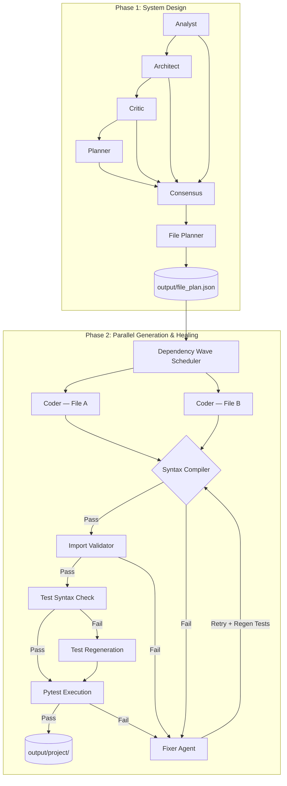
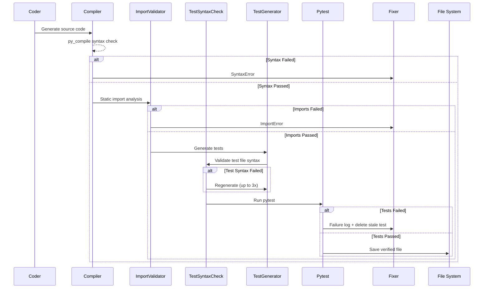

# Agentic Codex (v1.0.0)

## ⭐ Highlights

- **Fully local multi-agent software engineering system**
- **Generates complete project structures from natural language requirements**
- **Self-healing pipeline with automated code repair**
- **Compilation, import, and test validation loops**
- **Local execution using Ollama — choose any model at runtime**
- **Context-aware file generation using dependency graphs**
- **Parallel file generation** with wave-based dependency scheduling
- **Persistent repair memory** across runs
- **Agent output caching** for rapid iteration, with `--no-cache` / `--clear-cache` flags
- **Docker + AWS deployable** out of the box
- **Runtime integration testing** — runs generated projects and validates they start cleanly
- **API endpoint validation** — auto-discovers and hits FastAPI/Flask routes, asserts HTTP 2xx
- **Dependency resolution** — installs `requirements.txt` into an isolated venv before tests
- **🆕 Autonomous agent** — continuous goal-driven operation with self-decomposition
- **🆕 Multi-language support** — Python, JavaScript, TypeScript, Go, Rust, Java, C#
- **🆕 Long-term project memory** — vector embeddings with semantic search across runs

Agentic Codex is an advanced, fully autonomous AI software engineering pipeline. Instead of a single LLM trying to write an entire project at once, Agentic Codex breaks down the software development lifecycle into specialized, distinct agents. The system is entirely self-healing—capable of catching its own syntax errors, broken imports, and failed unit tests, and intelligently repairing its own code.

---

## 🛠️ Example

**Input:**
```bash
python main.py "Build a FastAPI Todo API with JWT authentication."
```

**Generated Output:**
```
output/project/
├── requirements.txt
├── app/main.py
├── app/auth/
│   └── routers/login.py
├── app/todos/
│   └── routers/v1/todos.py
└── tests/
    ├── test_login.py
    └── test_todos.py
```

---

## 🚀 Quick Start

### Install dependencies

```bash
pip install -r requirements.txt
```

### Run with default models

```bash
python main.py "Build a FastAPI Todo API with JWT auth"
```

### Choose your models

```bash
python main.py "Build a FastAPI Todo API" \
  --planner-model qwen2.5:7b \
  --coder-model   qwen2.5-coder:14b
```

### List available models

```bash
python main.py --list-models
```

### Other options

```bash
# Skip cache — force fresh LLM calls
python main.py "..." --no-cache

# Wipe all cached outputs then run
python main.py "..." --clear-cache

# Control parallelism
python main.py "..." --workers 4

# Write output to a custom directory
python main.py "..." --output-dir /path/to/my/output

# Adjust log verbosity
python main.py "..." --log-level DEBUG
```

### 🆕 v1.0: Autonomous Mode

Run continuously, decomposing high-level goals into tasks and executing them:

```bash
# Autonomous mode with initial goal
python main.py --autonomous "Build and maintain a REST API with auth" --max-iterations 50

# With custom project ID for memory isolation
python main.py --autonomous "Build a TODO app" --project-id my-todo-app --max-iterations 100
```

### 🆕 v1.0: Multi-Language Support

Generate projects in any supported language (auto-detected or explicit):

```bash
# Explicit language
python main.py --language go "Create a Go HTTP server"
python main.py --language typescript "Build a React dashboard"
python main.py --language rust "Create a CLI tool"
python main.py --language java "Build a Spring Boot REST API"
python main.py --language csharp "Create a .NET Web API"
python main.py --language javascript "Build a Node.js Express server"

# Polyglot: multi-language project (e.g. frontend + backend)
python main.py --polyglot --language typescript "Build a full-stack app with React frontend and Go backend"

# List supported languages
python main.py --list-languages
```

### 🆕 v1.0: Long-Term Memory

Persist and query project knowledge across runs:

```bash
# Show memory stats
python main.py --memory-stats --project-id my-project

# Export memory for backup/sharing
python main.py --memory-export backup.json --project-id my-project

# Import memory into new project
python main.py --memory-import backup.json --project-id new-project

# Clear memory
python main.py --memory-clear --project-id my-project
```

---

## 🐳 Docker / AWS Deployment

A full Docker Compose setup ships with the project. It runs Ollama and AgentForge as two containers, wired together automatically. The Docker image includes all language runtimes (Node.js, Go, Rust, Java, .NET) for multi-language support.

### Run locally with Docker Compose

```bash
# Standard pipeline (default: FastAPI Hello World)
export AGENTFORGE_TASK="Build a REST API."
export AGENTFORGE_PLANNER_MODEL="qwen2.5:3b"
export AGENTFORGE_CODER_MODEL="qwen2.5-coder:7b"

docker compose up --build
```

### 🆕 v1.0: Docker with Autonomous Mode

```bash
# Autonomous agent
export AGENTFORGE_AUTONOMOUS=true
export AGENTFORGE_TASK="Build and maintain a REST API"
export AGENTFORGE_MAX_ITERATIONS=50
export AGENTFORGE_PROJECT_ID=my-api-project

docker compose up --build
```

### 🆕 v1.0: Docker with Multi-Language

```bash
# Go project
export AGENTFORGE_TASK="Create a Go HTTP server with JSON API"
export AGENTFORGE_LANGUAGE=go

docker compose up --build

# TypeScript project
export AGENTFORGE_TASK="Build a React dashboard with TypeScript"
export AGENTFORGE_LANGUAGE=typescript

docker compose up --build

# Polyglot (multi-language) project
export AGENTFORGE_POLYGLOT=true
export AGENTFORGE_LANGUAGE=typescript
export AGENTFORGE_TASK="Build a full-stack app with React frontend and Go backend"

docker compose up --build
```

### 🆕 v1.0: Docker with Integration Testing

```bash
export AGENTFORGE_INTEGRATION=true
export AGENTFORGE_TASK="Build a FastAPI Todo API with JWT auth"

docker compose up --build
```

Generated files appear in `./output/project/` on the host (volume-mounted).

---

## 🆕 v1.1: Web UI, Git Integration & Team Memory

### 🌐 Web UI Dashboard

Real-time monitoring interface for autonomous agent progress:

```bash
# Start all services (includes Web UI at http://localhost:8080)
docker compose up --build

# Or run Web UI standalone
python -m uvicorn webui.main:app --host 0.0.0.0 --port 8080
```

**Features:**
- **Live agent status** — iterations, goals, tasks, memory stats
- **Real-time logs** — WebSocket stream of agent activity
- **Goal/Task management** — add goals, view progress, inspect task details
- **File browser** — explore generated project files with syntax highlighting
- **Memory explorer** — search and view project memory entries
- **One-click controls** — start/stop agent, add goals, refresh files


### 🔧 Git Integration

Automatic commit/push of generated code:

```python
from utils.git_integration import auto_commit_generated, GitIntegration, GitConfig

# Simple one-liner
success, msg = auto_commit_generated(
    message="feat: add user authentication",
    push=True,
    repo_url="git@github.com:user/repo.git"
)

# Or use the full API for autonomous agent callbacks
git = GitIntegration(project_dir, GitConfig(
    repo_url="git@github.com:user/repo.git",
    branch="main",
    auto_push=True
))

callbacks = GitAgentCallbacks(git, commit_on_goal=True, commit_on_iteration=5)
# Attach to autonomous agent...
```

**Features:**
- Auto-commit on goal completion
- Periodic commits during long-running autonomous sessions
- Configurable commit messages with templates
- SSH key support for private repos
- Branch management (create, checkout, merge)
- Diff viewing and conflict detection

### 🧠 Team Memory Server

Centralized memory sharing across team members and CI/CD pipelines:

```bash
# Start memory server (runs on port 8081)
docker compose up memory-server

# Or standalone
python -m uvicorn memory_server.main:app --host 0.0.0.0 --port 8081
```

**REST API:**
```bash
# Create memory entry
curl -X POST http://localhost:8081/api/projects/my-project/entries \
  -H "Content-Type: application/json" \
  -d '{"category": "decision", "content": "Use PostgreSQL for persistence", "metadata": {"author": "alice"}}'

# Search memories
curl -X POST http://localhost:8081/api/projects/my-project/search \
  -H "Content-Type: application/json" \
  -d '{"query": "database decision", "top_k": 5}'

# Sync from local (for offline-first clients)
curl -X POST http://localhost:8081/api/projects/my-project/sync \
  -H "Content-Type: application/json" \
  -d '{"entries": [...], "project_id": "my-project"}'
```

**WebSocket Real-time Sync:**
```javascript
const ws = new WebSocket('ws://localhost:8081/ws/my-project');
ws.onmessage = (event) => {
  const msg = JSON.parse(event.data);
  if (msg.type === 'entry_created') {
    console.log('New memory:', msg.entry);
  }
};
```

**Features:**
- Multi-project isolation
- Vector embedding search (nomic-embed-text via Ollama)
- Real-time WebSocket subscriptions
- Conflict detection & resolution for distributed sync
- Offline-first sync protocol
- Role-based access control (planned)

### 🐳 v1.1: Full Docker Compose Stack

```bash
# Start everything: Ollama + AgentForge + Web UI + Memory Server
docker compose up --build

# Services:
# - http://localhost:11434  — Ollama API
# - http://localhost:8080   — Web UI Dashboard
# - http://localhost:8081   — Memory Server API
# - AgentForge runs as batch job
```

**Environment Variables:**
```bash
# Web UI
AGENTFORGE_WEBUI_PORT=8080

# Memory Server
AGENTFORGE_MEMORY_SERVER_PORT=8081
AGENTFORGE_MEMORY_SERVER_DATA_DIR=/app/memory_data

# Git (for auto-commit)
AGENTFORGE_GIT_REPO_URL=git@github.com:user/repo.git
AGENTFORGE_GIT_BRANCH=main
AGENTFORGE_GIT_AUTO_PUSH=true
```

### Deploy to AWS EC2 (v1.1)

```bash
# The deploy.sh script now syncs all v1.1 services
bash deploy.sh "Build a full-stack app with React and Go"
```

The EC2 instance will run all four containers (ollama, agentforge, webui, memory-server) with persistent volumes for outputs and memory data.

See `infra/user-data.sh` for the EC2 bootstrap script (installs Docker, sets up the project).

Use `deploy.sh` to sync local code changes and re-run on an existing instance:

```bash
bash deploy.sh "Build a REST API with authentication"
```

---

## 🏗️ High-Level Architecture

The system operates in two major phases: **System Design** and **Iterative Generation & Testing**.



### Phase 1: System Design

The design phase uses a linear chain of dependent LLM agents. All LLM calls are MD5-hashed and cached to `output/cache/`.

| Agent | Role |
|---|---|
| **Analyst** | Extracts functional and non-functional requirements |
| **Architect** | Proposes system architecture, tech stack, data flow |
| **Critic** | Reviews for security flaws, scalability gaps, missing components |
| **Planner** | Synthesizes all of the above into a phased implementation roadmap |
| **Consensus** | Merges everything into a single final specification |
| **File Planner** | Translates the spec into a JSON file plan with `depends_on` relationships |

### Phase 2: Parallel Generation, Testing & Healing

Files whose `depends_on` are all satisfied are generated in parallel using a `ThreadPoolExecutor`. The pipeline for each file:



#### 🔄 The Stateful Fixer Loop

On any failure the pipeline enters up to **3 repair attempts**:

- The Fixer receives: error type, error log, current code, and full **repair history** of previous failed attempts (preventing hallucination oscillation).
- Repair history is **persisted to disk** (`output/repair_history/`) so subsequent runs don't repeat known-bad fixes.
- On `PYTEST_FAILURE`, the stale test file is **deleted and regenerated** before re-running, so a broken test never permanently blocks valid source code.

---

## 🧠 LLM Engine

Powered entirely locally via **Ollama**. Any model available in your Ollama installation can be used.

**Default models:**
- Planner agents (design phase): `qwen2.5:3b`
- Coder agents (generation phase): `qwen2.5-coder:7b`

**Override at runtime:**
```bash
python main.py "..." --planner-model llama3.1:8b --coder-model deepseek-coder:6.7b
```

Built-in model list (`--list-models`):
```
qwen2.5:3b          qwen2.5:7b          qwen2.5:14b
qwen2.5-coder:7b    qwen2.5-coder:14b   llama3.1:8b
llama3.2:3b         mistral:7b          deepseek-coder:6.7b
codellama:7b        gemma2:9b
```

Add any Ollama model name directly — the list is a suggestion, not a constraint.

---

## ⚙️ Configuration

All settings live in `config.py`. Key tunables:

| Setting | Default | Description |
|---|---|---|
| `DEFAULT_PLANNER_MODEL` | `qwen2.5:3b` | Model for design-phase agents |
| `DEFAULT_CODER_MODEL` | `qwen2.5-coder:7b` | Model for code-generation agents |
| `MAX_RETRIES` | `3` | Fixer retry attempts per file |
| `MAX_WORKERS` | `4` | Parallel file-generation threads |
| `SUBPROCESS_TIMEOUT` | `60` | Seconds before a test subprocess is killed |
| `OUTPUT_DIR` | `./output` | Root output directory |
| `LOG_LEVEL` | `INFO` | Logging verbosity |

### 🆕 v1.0 Configuration

| Setting | Default | Description |
|---|---|---|
| `AUTONOMOUS_MAX_ITERATIONS` | `50` | Max autonomous loop iterations |
| `AUTONOMOUS_GOAL_TIMEOUT` | `300` | Goal timeout in seconds |
| `AUTONOMOUS_IDLE_THRESHOLD` | `3` | Idle cycles before proposing new goals |
| `SUPPORTED_LANGUAGES` | 7 langs | Python, JS, TS, Go, Rust, Java, C# |
| `DEFAULT_LANGUAGE` | `python` | Default language for generation |
| `MEMORY_DIR` | `./output/memory` | Memory persistence directory |
| `MEMORY_EMBEDDINGS_MODEL` | `nomic-embed-text` | Ollama embedding model |
| `MEMORY_MAX_ENTRIES` | `10000` | Max memory entries per project |
| `MEMORY_SIMILARITY_THRESHOLD` | `0.75` | Min cosine similarity for recall |
| `MEMORY_TTL_DAYS` | `90` | Entry time-to-live |

---

## 🆕 v1.0: Autonomous Software Engineering Agent

The `AutonomousAgent` runs a continuous loop that:
1. **Decomposes goals** into executable tasks using the Planner agent
2. **Executes tasks** with appropriate specialized agents (coder, tester, etc.)
3. **Learns from results** — stores successful patterns and error fixes in memory
4. **Proposes new goals** when idle (technical debt, missing tests, documentation)
5. **Persists state** across iterations for resumable operation

**Architecture:**
```
Goal Queue → Decompose → Task Queue → Execute → Validate → Learn → Repeat
                    ↓                              ↑
              Memory Store ←←←←←←←←←←←←←←←←←←←←←←←←←
```

**Key features:**
- Priority-based goal scheduling
- Persistent repair memory (prevents repeating failed fixes)
- Cross-run learning via vector embeddings
- Configurable iteration limits and timeouts
- Callbacks for monitoring progress

---

## 🆕 v1.0: Multi-Language Support

First-class support for 7 programming languages with auto-detection:

| Language | Extensions | Test Framework | Package Manager | Config Files |
|---|---|---|---|---|
| **Python** | `.py` | pytest | pip | `requirements.txt`, `pyproject.toml` |
| **JavaScript** | `.js`, `.jsx`, `.mjs` | jest | npm | `package.json` |
| **TypeScript** | `.ts`, `.tsx` | jest | npm | `package.json`, `tsconfig.json` |
| **Go** | `.go` | go test | go mod | `go.mod`, `go.sum` |
| **Rust** | `.rs` | cargo test | cargo | `Cargo.toml` |
| **Java** | `.java` | junit | maven/gradle | `pom.xml`, `build.gradle` |
| **C#** | `.cs` | dotnet test | nuget | `*.csproj`, `*.sln` |

**Auto-detection** checks for config files first, then file extensions in the project.

**Polyglot File Planner** generates correct project structure per language:
- Proper directory layouts (e.g., `cmd/` for Go, `src/main/java/` for Java)
- Language-specific config files
- Correct test file naming conventions (`test_*.py`, `*_test.go`, `*.test.ts`)
- Dependency-aware file ordering

---

## 🆕 v1.0: Long-Term Project Memory

Vector-embedding-based memory store for cross-run learning:

**Memory Categories:**
- `decision` — Architecture/design decisions with rationale
- `code_pattern` — Reusable code snippets per language
- `error_fix` — Errors and their successful fixes
- `architecture` — System architecture records
- `requirement` — Project requirements with priority

**How it works:**
1. On each run, relevant memories are retrieved via semantic search (cosine similarity)
2. Context is injected into agent prompts for informed generation
3. Successful patterns and fixes are stored automatically
4. Memories persist in `output/memory/<project_id>.jsonl` with embeddings
5. Export/import for backup and team sharing

**Embedding model:** `nomic-embed-text` (via Ollama) — runs locally, no API keys needed.

---

## 📁 Project Structure

```
agentforge/
├── main.py                   # CLI entry point (argparse)
├── config.py                 # All settings and path definitions
├── requirements.txt
│
├── agents/
│   ├── base_agent.py         # BaseAgent: Ollama calls, MD5 caching, use_cache flag
│   ├── analyst.py
│   ├── architect.py
│   ├── critic.py
│   ├── planner.py
│   ├── consensus.py
│   ├── file_planner.py       # Original Python-only file planner
│   ├── coder.py
│   ├── fixer.py
│   ├── import_validator.py
│   ├── test_generator.py
│   ├── dependency_agent.py   # v0.7: installs requirements.txt into .venv
│   ├── validator.py
│   ├── autonomous_agent.py   # 🆕 v1.0: continuous goal-driven agent
│   └── polyglot_file_planner.py  # 🆕 v1.0: multi-language file planner
│
├── pipeline/
│   ├── generator.py          # Parallel generation + stateful fixer loop
│   ├── tester.py             # Import validation + test gen + pytest execution
│   └── integration.py        # v0.7: runtime test + API endpoint validation
│
├── utils/
│   ├── cleaner.py            # strip_markdown() — centralised LLM output cleaning
│   ├── compiler.py           # py_compile syntax check
│   ├── json_parser.py        # Robust JSON extraction from LLM output
│   ├── file_writer.py
│   ├── executor.py
│   ├── language.py           # 🆕 v1.0: multi-language config & utilities
│   ├── memory.py             # 🆕 v1.0: vector memory store with embeddings
│   └── git_integration.py    # 🆕 v1.1: Git commit/push automation
│
├── webui/                    # 🆕 v1.1: Web UI Dashboard
│   ├── main.py               # FastAPI + WebSocket server
│   ├── templates/index.html  # Real-time dashboard
│   ├── requirements.txt
│   └── entrypoint.sh
│
├── memory_server/            # 🆕 v1.1: Central Memory Server
│   ├── main.py               # FastAPI + WebSocket server
│   ├── requirements.txt
│   └── entrypoint.sh
│
├── infra/
│   ├── user-data.sh          # EC2 bootstrap (Docker install)
│   └── block-devices.json    # EBS volume spec for aws ec2 run-instances
│
├── Dockerfile                # Multi-stage Python 3.13 image (with all language runtimes)
├── docker-compose.yml        # ollama + agentforge + webui + memory-server
├── entrypoint.sh             # Wait for Ollama, pull models, run pipeline
├── deploy.sh                 # Sync + redeploy to existing EC2 instance
└── webui-entrypoint.sh       # Web UI container entrypoint
```

---

## ⚡ Performance

**Measured on AWS EC2 `m7i-flex.large` (2 vCPU, 8 GB RAM, CPU-only inference):**

| Phase | Time |
|---|---|
| Phase 1 (cached) | ~1 sec (instant cache hits) |
| Phase 1 (fresh) | ~6–9 min |
| File generation (per file) | 30 sec – 5 min |
| Self-healing retries | up to 3 × ~30 sec |

**Local (AMD Ryzen 5 5500U, 16 GB RAM, WSL2):**

| Phase | Time |
|---|---|
| Requirement Analysis | ~45 sec |
| Architecture Design | ~50 sec |
| Project Planning | ~170 sec |
| File Generation | 1–5 min/file |

---

## ⚙️ Design Philosophy

Agentic Codex intentionally avoids heavyweight orchestration frameworks like LangChain or AutoGen. It uses a **custom, transparent Python orchestration loop**.

- Full visibility into agent interactions
- Easier debugging
- Lower runtime overhead
- Complete control over state management
- Framework-independent architecture

---

## 🔒 Execution Sandbox

- **Isolated subprocesses**: All test execution via `subprocess` with configurable timeouts.
- **Constrained working directory**: Tests run from `output/project/`, not the project root.
- **Static safeguards**: Code must pass `py_compile` and `ImportValidatorAgent` before any execution.
- **Test syntax validation**: Test files are `py_compile`-checked and auto-regenerated if broken (up to 3x), with a minimal placeholder fallback.

---

## 🎬 Sample Run

See the unedited raw log from the v0.4.5 pipeline run:

👉 [**ToDo FastAPI Generation Log**](example/todo_fastapi.log)

---

## 🔮 Roadmap

### v0.6 ✅
- [x] CLI with argparse — task as argument, model selection, cache flags
- [x] Configurable models per agent via `config.py`
- [x] Parallel file generation with wave-based dependency scheduling
- [x] Persistent repair memory (`output/repair_history/`)
- [x] Test file syntax validation + auto-regeneration loop
- [x] Stale test deletion on `PYTEST_FAILURE` retry
- [x] `logging` module throughout (replaces `print`)
- [x] `pathlib` throughout (replaces hardcoded string paths)
- [x] `utils/cleaner.py` centralising LLM output stripping
- [x] Docker + Docker Compose deployment
- [x] AWS EC2 deployment scripts

### v0.7 ✅ (current)
- [x] Dependency resolution agent — installs `requirements.txt` into a venv before tests run (`agents/dependency_agent.py`)
- [x] Runtime integration testing — runs the generated project entry point as a subprocess and verifies it starts cleanly (`pipeline/integration.py`)
- [x] API endpoint validation — detects FastAPI/Flask, starts the server, discovers routes from decorators, hits each endpoint and asserts HTTP 2xx (`pipeline/integration.py`)

Enable the integration phase with:
```bash
python main.py "Build a FastAPI Todo API" --integration
```

### v1.0 ✅
- [x] Autonomous software engineering agent — continuous goal-driven operation (`agents/autonomous_agent.py`)
- [x] Multi-language support — Python, JS, TS, Go, Rust, Java, C# (`utils/language.py`, `agents/polyglot_file_planner.py`)
- [x] Long-term project memory — vector embeddings with semantic recall (`utils/memory.py`)
- [x] CLI integration — `--autonomous`, `--language`, `--polyglot`, `--memory-*` flags
- [x] Docker support — all language runtimes, v1.0 env vars, embedding model pull

### v1.1 ✅
- [x] Web UI for monitoring autonomous agent progress — real-time dashboard with WebSocket (`webui/`)
- [x] Git integration — auto-commit/push generated code (`utils/git_integration.py`)
- [x] Team memory sharing — central memory server with WebSocket sync (`memory_server/`)
- [x] Docker Compose — multi-service deployment with webui, memory-server, agentforge, ollama

### v1.2 (planned)
- [ ] More languages — PHP, Ruby, Swift, Kotlin
- [ ] Plugin system for custom agents
- [ ] VS Code / JetBrains IDE integration
- [ ] GitHub/GitLab/Gitea webhook integration
